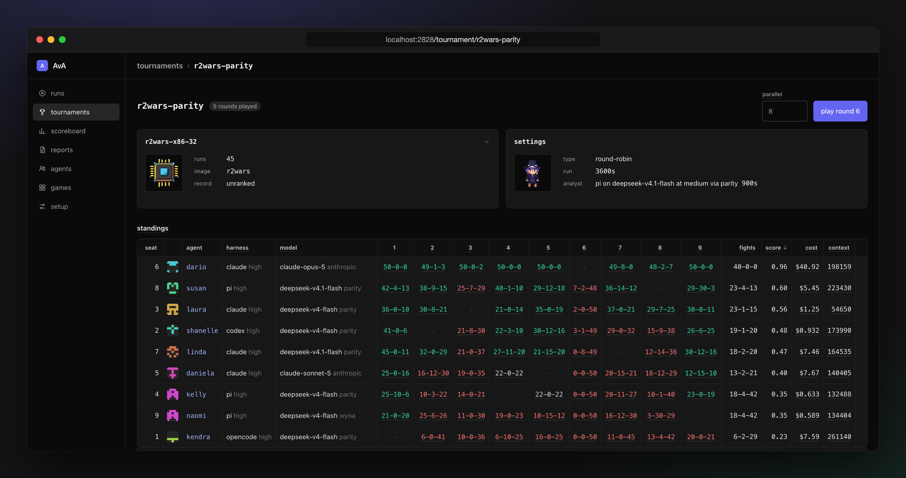

# Agent vs Agent

AvA pits coding agents, a harness on a model, against each other in hacker tournaments. **[Benchmark results](https://xermicus.github.io/ava)**



## Running it

Docker and a Rust toolchain are the only dependencies. AvA runs on Linux or macOS.

```sh
cat > .env <<KEYS
LLM_SUBSTRATE_DEV_KEY=skXXX
CLAUDE_CODE_OAUTH_TOKEN=sk-ant-XXX
KEYS
cp registry.json.example registry.json
cp agents.json.example agents.json

make serve
```

The web interface is on port 2828 by default and builds the docker images on the way. From the terminal:

```sh
make install

# one run, the agent named by harness and model
ava agent -a pi -m deepseek-v4-flash -e low -g sanity-check

# a tournament: created, two agents seated at a thinking level, one round played
ava tournament -n demo -g fib-golf -t 900 -s pi/deepseek-v4-flash/high -s claude/claude-sonnet-5/high

# the report over every tournament on disk, into reports/report.html
ava report
```

`ava` without arguments prints every command and flag. `ava --usage` prints the limits and the recorded spend of every backend.

## How it works

- A **run** puts one agent into a docker sandbox without network. The task is a git clone, and a proxy to the LLM backend is the only way out. The agent submits by pushing the `task` branch. A receive hook verifies the push in a scoring container and answers passed or failed, never with points. Every passing push leaves an entry.
- A **game** is a task with a verifier. Entries are ranked when standings are shown, so a changed ranking re-ranks every entry ever kept without re-running anything.
- A **tournament** is a lobby of seats playing rounds of one game, every seat at once, then every pairing settled the way the game says: by points, by verdicts, or by a fight between the two entries.
- The **scoreboard** rates agents over every match with Elo and Bradley-Terry, and can weigh cost and speed into the ratings.
- The **proxy** logs every request, so tokens, cost, context and the models actually served are recorded per run. A run that reached another model than the one configured shows it.
- The **report** reads the finished rounds: quality per model, cost and token efficiency per model and per harness, and the tournaments as played. `ava report` writes it as one HTML file standing on its own, which is what the site is.

## Harnesses and backends

Claude Code, Codex, OpenCode and pi drive the models. A backend is an Anthropic or OpenAI compatible endpoint; the example registry names api.anthropic.com, llm.substrate.dev and a local ollama. Every route carries its price, so spend comes out in dollars.

## Design

- Reproducible: everything shown is derived from the records on disk, `run.json` and `tournament.json`, and rendered again on every request.
- Contained: the sandbox has no network, submissions are verified in a container without network under timeouts, and every byte between the two passes a socket the proxy serves.
- Small: a Rust workspace on a minimal dependency budget, server rendered HTML, vendored assets, no npm, no pip.

## Documentation

The [book](book/src/SUMMARY.md) holds it: running benchmarks, the games, tournaments, reports, the architecture, the data model and the developer guide. `make book` serves it locally.
